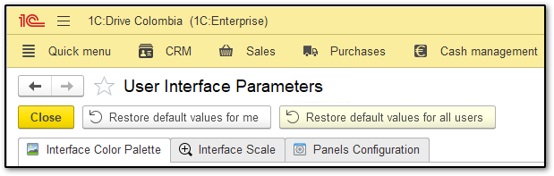

# User Interface Parameters Extension for 1C:Drive

The "User Interface Parameters" is an extension developed for 1C:Drive 1.5+ by Axial ERP. It extends the existing interface customization options, allowing individual users to fine-tune the UI according to specific requirements and preferences.
Three languages are supported - English, Spanish and Russian.

## Key Features

*   Color Schemes: Choose from a predefined list of color schemes to align the interface with specific workflows or visual preferences.
*   Form Scales: Opt between two distinct form scales—Compact Mode and Full Scale Mode—for an optimized user experience that best fits your device and task at hand.

## Accessing the Configuration Window

You can access the extension via the Quick Menu by simply clicking on "Configure User Interface Settings."

## How to use

Upon entering the configuration window, you'll encounter two sections: one focused on style selection and the other on interface scaling. Here are the relevant buttons and their functionalities:

*   Close: Click to close the window.
*   Restore Default Values for Me: Use this button to revert your interface settings to the default values.
*   Restore Default Values for All Users: Exclusive to users with administrative roles, this button assigns default interface values to all users.

## Style selection page

By choosing a predefined style, you can easily distinguish between different environments (production/staging/quality assurance), differentiate among various companies and infobases, and select an interface that aligns with your personal preferences.

The extension provides a list of predefined styles for users to select from, with the user interface preview on the right updating automatically each time a style is chosen.

Select a style and click "Set Selected Style for Me" to update your information and receive a confirmation message. To apply the changes, restart the application by clicking "Restart," as depicted below.

Administrators have access to an additional button allowing them to select a predefined style for all users. When a style is chosen and "Set Selected Style for All Users" is clicked, a message will appear, notifying that this selection will impact all users and requesting confirmation to update the information. Following confirmation, a restart is required for the changes to take effect.

## Interface scale page

Within our interface customization options, you have the flexibility to choose between two distinct scales: Compact Mode and Full Scale Mode.

*   Compact Mode: Designed for efficiency, Compact Mode optimizes your interface, making the most of screen real estate. It's ideal for smaller displays and tasks requiring focused attention. While maximizing productivity, please note that some finer details may be less prominent.

*   Full Scale Mode : If you prefer a comprehensive view, Full Scale Mode, which is the default mode, expands your interface to reveal all features and intricate details. This is especially advantageous on larger screens, providing ample space for in-depth tasks. However, be aware that Full Scale Mode may occupy a significant portion of your screen, so consider the benefits against potential workspace reduction.

Our interface scaling options accommodate various needs. Whether you prioritize efficiency or a comprehensive view, you have the freedom to choose the mode that best suits your preferences and enhances your overall user experience.

Select your preferred option by clicking the corresponding button. Upon selection, a confirmation message will appear, indicating that the interface scaling has been modified and requesting an application restart to reflect the changes in the platform.

Administrators have additional options to select a predefined scaling mode for all users through the buttons provided. If an administrator selects any option for all users, a message will appear, cautioning that this selection will affect all users and requesting confirmation to update the information. After confirmation, a restart is required to see the changes reflected in the platform.

----------------------------------------------------------------------
# Disclaimer:
* This source code is shared under the MIT License. Please refer to the LICENSE file for detailed terms and conditions.
* All software and artifacts contained in this repository are provided "as-is" without any warranty. Users are advised to exercise their discretion while using this software and to ensure that it meets their individual requirements. The authors/maintainers are not liable for any damages, data loss, or issues resulting from the use of this software.
* The compiled version of the configuration extension can be found under the "Releases" section of this repository.
* We warmly welcome community contributions! If you wish to enhance this repository, please fork it and submit your changes via a pull request. Ensure your code aligns with general standards and describe your changes in the pull request. Together, we can make this project even better.
 
# Credits:
* Thanks to [SeiOkami](https://github.com/SeiOkami/) for Russian translation
